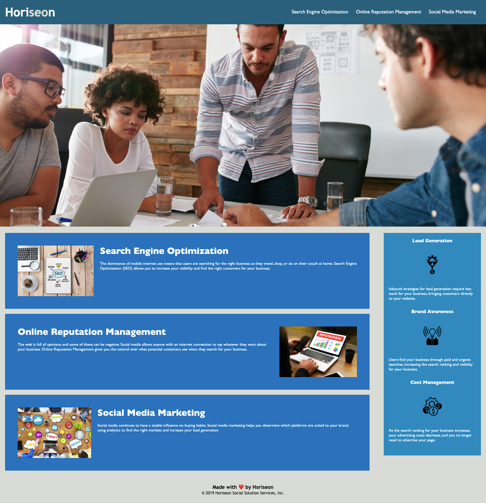

# Horiseon
 
 ## Description
 A website simple one page website that explains SEO (Search Engine Optimization), Online Reputation Management, and Social Media Marketing. 


[deployed link here](google.com)

 ## User Story 
 ```
GIVEN a webpage meets accessibility standards
WHEN I view the source code
THEN I find semantic HTML elements
WHEN I view the structure of the HTML elements
THEN I find that the elements follow a logical structure independent of styling and positioning
WHEN I view the icon and image elements
THEN I find accessible alt attributes
WHEN I view the heading attributes
THEN they fall in sequential order
WHEN I view the title element
THEN I find a concise, descriptive title
```


### License 


